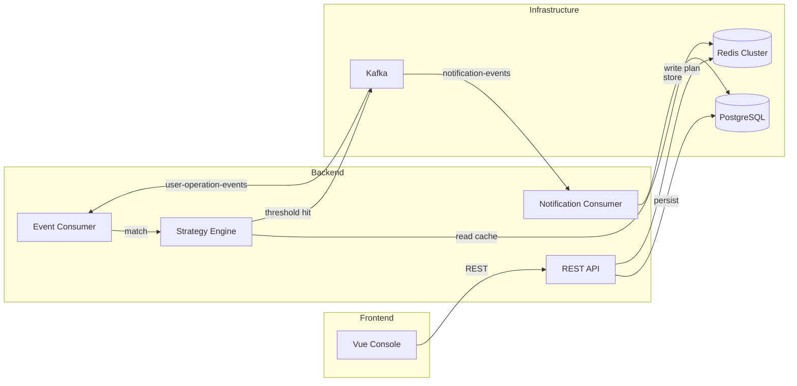
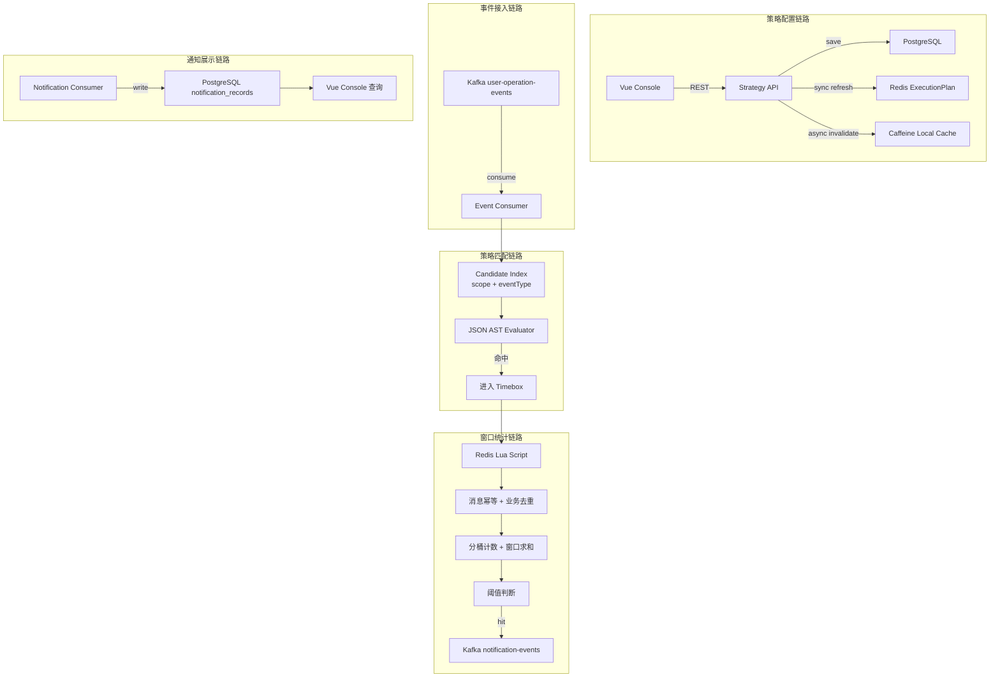
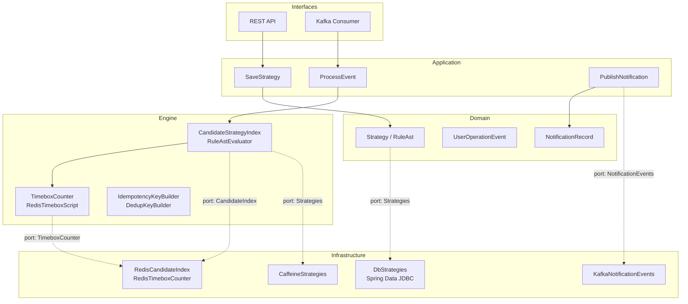
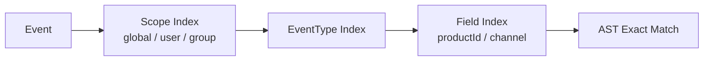
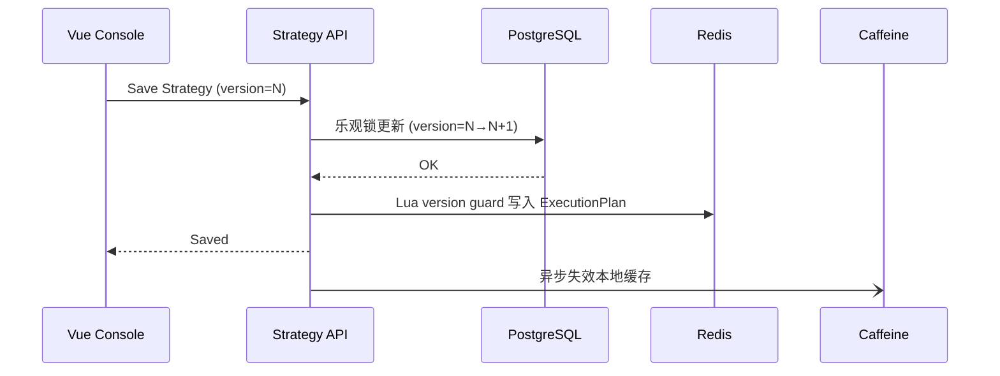
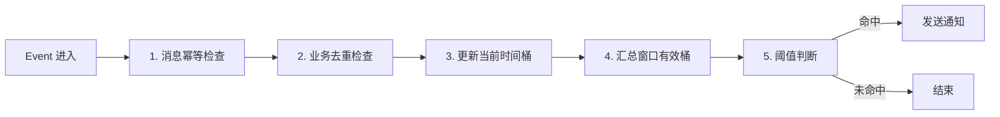
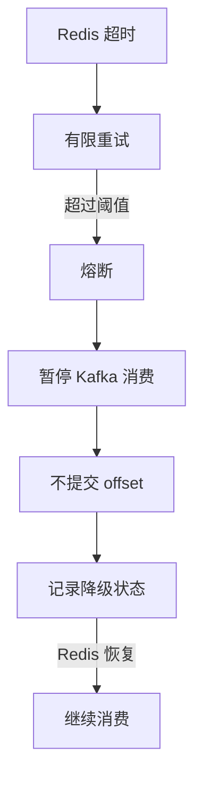

# Notify System

一个事件驱动的通知策略引擎。用户操作事件进入 Kafka，系统按客户配置的策略做规则匹配、滑动时间窗口聚合和业务去重，满足阈值后发送通知并落库。

## License

本项目源代码及技术设计文档均遵循 [SSPL-1.0](LICENSE) 协议。SSPL 是基于 AGPL 修改的 copyleft 许可证，核心区别在于：如果你将本程序的功能作为服务提供给第三方（例如 SaaS），你不仅需要公开本项目源码，还必须公开支撑该服务的全部基础设施源码（管理软件、用户界面、监控、存储、托管等），使得他人能够自行运行完整的服务实例。内部使用、学习和修改不受限制。完整条款见 [LICENSE](LICENSE)。

---

## 架构概览



### 五条链路



## 分层架构

项目采用领域驱动设计（DDD），以六边形架构组织代码。Engine 层作为高频热路径的独立执行域。



| 层 | 包 | 职责 | 设计原则 |
|---|---|---|---|
| **Interfaces** | `interfaces.rest` `interfaces.kafka` | REST 端点、Kafka 消费者 | 入站适配，不含业务逻辑 |
| **Application** | `application.strategy` `application.event` `application.notification` | 用例编排 | 协调 Domain 和 Infrastructure |
| **Domain** | `domain.strategy` `domain.event` `domain.notification` `domain.exception` | 领域模型与值对象 | 拒绝原生类型，显式建模概念 |
| **Engine** | `engine.matching` `engine.timebox` `engine.idempotency` | 规则匹配、窗口计数、去重 | 性能优先，允许 primitive 和轻量 DTO |
| **Infrastructure** | `infrastructure.persistence` `infrastructure.redis` `infrastructure.kafka` `infrastructure.cache` | 存储与中间件实现 | 实现 Domain 层定义的端口 |

## 策略模型

### 规则编辑与 AST

前端按行编辑规则（字段 / 算子 / 值 / 连接关系），后端保存后转换为 JSON AST：

```
rule_items → JSON AST → StrategyExecutionPlan → Redis/Caffeine
```

AST 支持 `AND` / `OR` / `NOT` 逻辑组合和 `EQ` / `IN` / `GT` / `BETWEEN` / `REGEX` 等比较算子。示例：

```json
{
  "op": "AND",
  "children": [
    { "field": "eventType", "operator": "EQ", "value": "PRODUCT_VIEW" },
    { "field": "productId", "operator": "IN", "value": ["P001", "P002"] }
  ]
}
```

### 候选策略索引

不扫描全部策略，而是通过多级索引缩小候选集：



Redis 索引结构：

```
idx:scope:global              → {strategyIds}
idx:scope:user:{userId}       → {strategyIds}
idx:scope:group:{groupId}     → {strategyIds}
idx:eventType:{eventType}     → {strategyIds}
idx:field:productId:{value}   → {strategyIds}
```

候选集 = `scopeCandidates ∪ eventTypeCandidates ∩ fieldCandidates`，最终对候选策略执行 AST 精确判断。

### 缓存刷新策略



PostgreSQL 是策略版本的权威来源。Redis 刷新使用 Lua version guard（只有新版本 >= 当前版本才覆盖），Caffeine 通过异步事件 + TTL 双重保障失效。

## Timebox 分桶计数

窗口统计使用 Redis Timebox，Lua 脚本在 Redis 内原子完成：



Key 粒度：`strategyId + customerId + dedupDimensionsHash`，TTL = `windowSize + shardSize × 2`。

## Kafka 与补偿机制

### Topic 设计

| Topic | Partitions | 说明 |
|---|---|---|
| `user-operation-events` | 24 | 按 `customerId` 分区 |
| `notification-events` | 24 | 通知事件 |
| `user-operation-events-dlt` | 6 | 处理失败死信 |
| `notification-events-dlt` | 6 | 通知失败死信 |

### 消费语义

- Producer 开启幂等 (`enable.idempotence=true`)
- Consumer 手动提交 offset，关键处理失败不提交
- DLT 不是垃圾桶，失败消息写入异常表供前端查询

### Redis 降级



不把正常消息丢入 DLT——消息本身没有错，只是依赖不可用。

## 技术栈

| 组件 | 版本 | 用途 |
|---|---|---|
| Java / Spring Boot | 21 / 3.5 | 后端框架 |
| Gradle | — | 构建工具 |
| PostgreSQL | 16 | 持久化 (主从读写分离) |
| Redis | 7 Cluster | 策略缓存、Timebox 计数 |
| Kafka | 7.6 | 事件流 |
| Caffeine | 3.1 | 本地热点缓存 |
| Vue / Vite / Tailwind | 3 / 7 / 4 | 前端 |
| Docker Compose | — | 本地环境编排 |

## 压力测试

> 完整报告见 [`reports/pressure-test-report.md`](reports/pressure-test-report.md)

### 测试环境

Docker Compose 部署（PostgreSQL 主从、Redis Cluster 3 节点、Kafka 单 broker），后端单实例运行。测试工具为 Shell 脚本并发 curl，策略业务去重窗口设为 0s 以消除去重干扰，直接测量端到端吞吐。

### 测试场景

| 场景 | 维度 | 覆盖范围 |
|---|---|---|
| S1 基线 | 单用户，递增请求量 | 500 / 1,000 / 2,000 / 5,000 |
| S2 用户扩展 | 固定 2,000 请求，递增用户数 | 10 / 50 / 100 / 300 用户 |
| S3 吞吐量 | 高并发 + 高请求量 | 2,000 / 5,000 / 10,000 请求，20-100 并发 |
| S4 混合事件 | 2 种事件类型 × 2 个策略 | PRODUCT_VIEW + LOGIN |

共发送 **33,500 条**事件请求，全部由后端接收、匹配、Redis Timebox 聚合、Kafka 通知、PostgreSQL 落库的完整链路处理。

### 关键指标

| 指标 | 数据 |
|---|---|
| **TPS** | 73 – 90 req/s，全场景稳定（均值 ~84） |
| **错误率** | **0.00%**（33,500 请求零错误） |
| **P50 延迟** | 4.4 – 11.2 ms |
| **P95 延迟** | 9.9 – 67.4 ms |
| **P99 延迟** | 14.6 – 100.8 ms（最高值出现在混合事件 LOGIN 场景，单次 Lua + Kafka 联动） |
| **通知产出** | 1,002 条通知成功写入 PostgreSQL |
| **最大验证规模** | 10,000 请求 / 100 并发，P99 = 87.6 ms，零错误 |
| **系统稳定性** | 压测后 Redis HEALTHY、Kafka RUNNING、无降级 |

### 延迟分布

| 场景 | 请求量 | 并发 | P50 | P95 | P99 |
|---|---|---|---|---|---|
| S1-500 | 500 | 10 | 5.5 ms | 20.0 ms | 34.7 ms |
| S1-2000 | 2,000 | 10 | 4.9 ms | 13.1 ms | 26.8 ms |
| S1-5000 | 5,000 | 10 | 4.4 ms | 10.1 ms | 19.2 ms |
| S2-300users | 2,000 | 20 | 8.3 ms | 23.6 ms | 40.4 ms |
| S3-10000 | 10,000 | 100 | 11.2 ms | 48.8 ms | 87.6 ms |
| S4-LOGIN | 1,000 | 20 | 21.8 ms | 67.4 ms | 100.8 ms |

### 资源占用（10,000 请求后）

| 服务 | CPU | 内存 |
|---|---|---|
| Backend (Java) | 1.26% | 1.24 GiB |
| PostgreSQL Primary | 0.01% | 42.7 MiB |
| PostgreSQL Replica | 0.03% | 40.4 MiB |
| Redis × 3 | ~1.2% | 5.5 MiB / 节点 |
| Kafka | 1.49% | 513.9 MiB |

**结论：** 按此方案部署下，系统稳定处理 10,000 条事件的端到端链路，P99 延迟控制在 100ms 以内，零错误，资源占用低。瓶颈在单机 HTTP 客户端并发能力，后端 P50 延迟仅 5-11ms，仍有充足的吞吐余量。

### 复现压测

```bash
# 启动完整 Docker 栈
docker-compose up -d

# 等待后端健康（约 2 分钟首次构建）
curl http://localhost:8080/api/status

# 运行压测
bash scripts/pressure/run-pressure.sh http://localhost:8080
```

## 快速开始

### 前置条件

- [Colima](https://github.com/abiosoft/colima)（或 Docker Desktop）已安装并运行
- Java 21（构建后端）
- Node.js 22（前端开发服务器）

### 一键启动（推荐）

```bash
# 1. 确保 Docker runtime 在运行
colima start

# 2. 启动所有基础设施 + 后端（自动构建最新代码）
docker-compose up -d

# 3. 启动前端（本地 Vite，不用 Docker）
cd frontend && npm run dev
```

**说明：** `docker-compose up -d` 会启动 PostgreSQL（主从）、Redis Cluster（3 节点）、Kafka + Zookeeper，以及后端容器。后端容器**每次启动都会先执行 `./gradlew clean bootJar` 再运行 jar**，确保跑的永远是最新的代码。Gradle 缓存通过 Docker volume 持久化，首次构建约 2 分钟，后续约 10 秒。

前端在 Docker 中因 rollup native 模块不兼容，需要本地启动 Vite 开发服务器。

### 停止

```bash
docker-compose down          # 停止并删除容器（数据不保留）
docker-compose down -v       # 停止并删除容器 + volumes
```

### 服务地址

| 服务 | 地址 | 说明 |
|---|---|---|
| Backend API | `http://localhost:8080` | Docker 容器，自动构建 |
| Frontend | `http://localhost:5173` | 本地 Vite |
| PostgreSQL Primary | `localhost:5432` | user: `notify`, db: `notify` |
| PostgreSQL Replica | `localhost:5433` | 只读副本 |
| Redis Cluster | `localhost:6379-6381` | 3 节点集群 |
| Kafka | `localhost:9092` | 单 broker |

### 注意事项

- 如果 Colima 重启后 Redis Cluster 报错（`cluster_state:fail`），需要删除 Redis 容器重建：`docker-compose down && docker-compose up -d`
- Zookeeper 健康检查使用 `srvr` 命令（`ruok` 在新版 ZK 中被白名单禁止）
- 后端 healthcheck 等待时间较长（`start_period: 60s`），首次构建需要耐心等待

### 本地开发（不使用 Docker）

```bash
# 后端（需要本地 PostgreSQL + Redis）
cd backend && JAVA_HOME=$(/usr/libexec/java_home -v 21) ./gradlew bootRun

# 后端（使用 H2 内存数据库，无需 PostgreSQL）
cd backend && JAVA_HOME=$(/usr/libexec/java_home -v 21) ./gradlew bootRun \
  --args='--spring.datasource.url=jdbc:h2:mem:notify --spring.datasource.driver-class-name=org.h2.Driver --spring.datasource.username=sa'

# 前端
cd frontend && npm install && npm run dev
```

### 测试

```bash
cd backend && JAVA_HOME=$(/usr/libexec/java_home -v 21) ./gradlew test  # 单元测试
```
